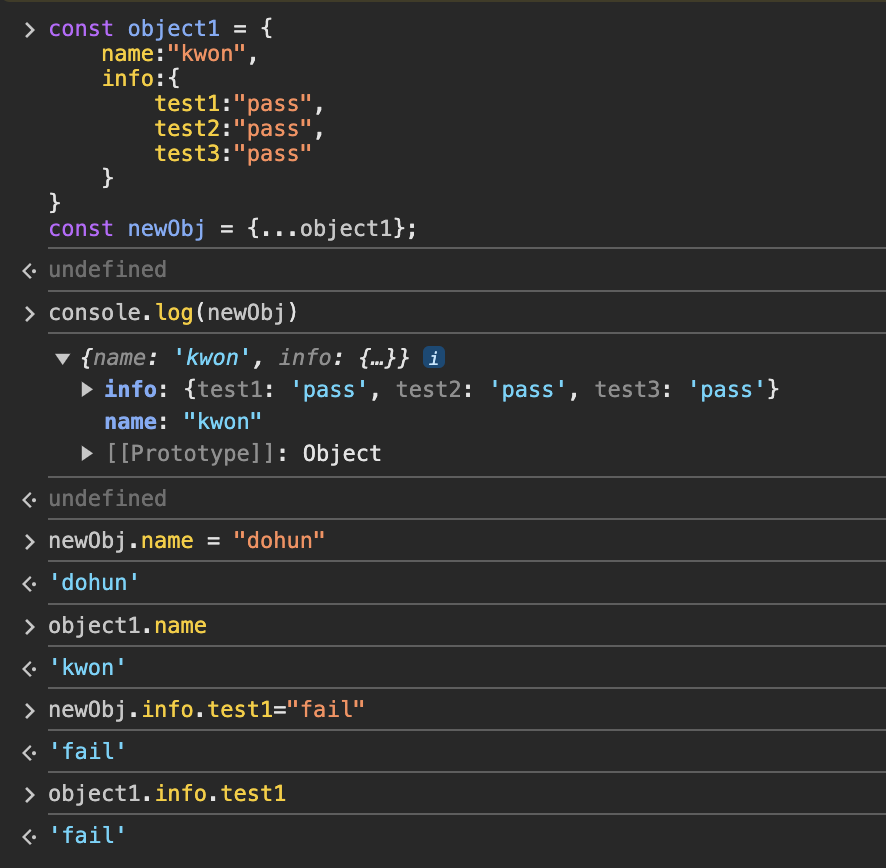

# 구조 분해 할당 (Destructuring assignment)
## `구조 분해 할당이란?`
배열이나 객체의 속성을 분해하여, 그 값을 개별 변수에 담을 수 있게 하는 JavaScript 표현식이다.<br>
개발을 하다 보면 함수에 객체나 배열을 전달해야 하는 경우가 생기곤 한다. 가끔은 객체나 배열에 저장된 데이터 전체가 아닌 일부만 필요한 경우가 생기기도 한다. 이럴 때 유용하게 사용 가능하다.

```javascript
let arr = ["kwon", "dohun", 24];
//이름과 나이만 가져오고 싶음.
let [name,,age] = arr;
//출력결과: kwon 24
console.log(name, age);
```

이러한 Destructuring은 객체에서도 마찬가지로 사용이 가능하다.

```javascript
const user = {
    Fname: "Kwon",
    Lname: "Dohun",
    age: 24
};
//프로퍼티명을 기준으로 값을 받아오기때문에 임의로 변경 불가!
//다른 변수명으로 받아오고 싶으면 콜론(:)기호를 사용한다.
const {Fname, age} = user
const {Fname: name} = user
//Kwon 24
console.log(Fname, age)
//Kwon
console.log(name)
```
디스트럭처링 구문은 함수 매개변수 목록에서도 사용할 수 있다.

예를 들어, 함수가 어떤 객체를 매개변수 인자로 전달받는 경우에 객체 프로퍼티를 꺼내서 직접 로컬 범위 변수로 **바로** 사용할 수 있도록 함수를 디스트럭처링할 수 있다.
```javascript
//일반적인 방법(점 표기법을 통해 객체 프로퍼티에 접근)
function storeOrder(order) {
  localStorage.setItem('id', order.id);
  localStorage.setItem('currency', order.currency);
}

//디스트럭처링 사용
function storeOrder({id, pw}) { // 디스트럭처링
  localStorage.setItem('id', id);
  localStorage.setItem('pw', pw);
}

//디스트럭처링 자세한 예제
function storeOrder({id, pw}) { // 디스트럭처링
  localStorage.setItem('id', id);
  localStorage.setItem('pw', pw);
}
let user = {id:"user1", pw:"1234", isLogin:"false"}
//id,pw 변수에 user의 id,pw 프로퍼티 값이 담기게 됨.
storeOrder(user);
```
---
## `스프레드 연산자(...) (feat.깊은 복사)`
객체나 배열 전체 혹은 일부를 병합하여 다른 객체나 배열로 복사하려고 할 때 스프레드 연산자를 사용할 수 있다.<br>
```javascript
//구조배열할당 + 스프레드연산 활용
var a, b, rest;
[a, b] = [10, 20];

console.log(a); // 10
console.log(b); // 20

[a, b, ...rest] = [10, 20, 30, 40, 50];

console.log(rest); // [30,40,50]

//나머지 원소는 다 rest에 담기게됨

({a, b, ...rest} = {a: 10, b: 20, c: 30, d: 40});
console.log(a); // 10
console.log(b); // 20
console.log(rest); // {c: 30, d: 40}
```
단, 스프레드 연산자는 1depth의 값에서만 깊은 복사를 실행한다.<br>
```javascript
const object1 = {
    name:"kwon",
    info:{
        test1:"pass",
        test2:"pass",
        test3:"pass"
    }
}
const newObj = {...object1};
```
위와 같은 경우에는 **`name 프로퍼티는 깊은 복사를 수행`**해서 newObj의 name 프로퍼티는 완전히 새로운 메모리 공간을 참조하게 되지만, 중첩객체인 info 프로퍼티는 얕은복사를 수행하여 **`여전히 object1이 가리키고있는 info 객체 주소를 가리킨다`**.<br>
즉, 같은 공간을 서로 다른 두 객체가 동일하게 가리키고 있는 것이다.<br>
따라서 **두 객체 중 한 곳에서 값을 변경하면 서로 영향을 받게되어 치명적인 오류를 발생**시킬 수 있다.<br>
아래 사진은 이를 실제로 콘솔창에서 확인해본 결과이다.


---

## 비동기와 콜백 함수
콜백 함수는 자바스크립트의 일급 객체 특성을 이용해 함수의 매개변수에 함수 자체를 넘겨, 함수 내에서 매개변수 함수를 실행하는 기법을 말한다.<br>
한마디로, 콜백 함수는 비동기 함수에서 작업 결과를 전달받아 처리하는데 사용되어 작업 순서를 맞출수 있게 되는 것이다.
```javascript
function getData(callback) {
    // 데이터베이스로부터 3초 후에 데이터 값을 받아온 후, 콜백 함수 호출
    setTimeout(() => {
        const value = 100;
        callback(value);
    }, 3000);
}

function main() {
    // 호출할 작업에 콜백 함수를 넘긴다
    getData(function(value) {
        let data = value * 2;
        console.log('data의 값 : ', data);
    });
}
main();
```
위와 같이, 콜백 함수를 사용해서 비동기를 순차적으로 처리하는 것은 단순히 자바스크립트에서 함수가 일급 객체라는 점을 이용한 편법이다.<br>
따라서 자바스크립트의 **`Promise`** 객체는 이러한 한계점을 극복하기 위해 **비동기 처리를 위한 전용 객체로서 탄생**하였다. Promise는 **`비동기 작업의 성공 또는 실패와 그 결과값을 나타내는 객체`** 이다. 그래서 Promise를 사용하면 비동기 작업을 쉽고 깔끔하게 연결할 수 있게 된다.

~~~javascript
function getData() {
    //Promise를 반환
  return new Promise((resolve) => {
    setTimeout(() => {
      const value = 100;
      //해당 프로미스가 성공적으로 완료되었음을 알리고, value 함께 전달
      resolve(value);
    }, 3000);
  });
}

function main() {
  getData()
  //getData에서 반환된 Promise 상태가 fulfil되면 수행
    .then((value) => {
        //data = 100 * 2
      let data = value * 2;
      console.log('data의 값 : ', data);
    })
    .catch((error) => {
      console.error(error);
    });
}
main();
~~~

근데 Promise를 활용하는 것도 분명 한계가 있다. 왜냐하면 콜백 지옥이 있듯이 지나친 then 핸들러 함수의 남용으로 인한 프로미스 지옥이 존재하기 때문이다.<br>
그래서 자바스크립트에는 **`async/await`** 라는 문법이 추가되었다.<br> async/await는 프로미스를 기반으로 하지만, **마치 동기 코드처럼 작성할 수 있게 해준다.** 

~~~javascript
function getData() {
    //만약에 reject 콜백이 수행되면 promise 상태가 reject되었음을 알리는 것임.
    return new Promise((resolve, reject) => {
        // 데이터베이스에서 값을 가져오는 3초 걸린다고 가정 (비동기 처리)
        setTimeout(() => {
            const value = 100;
            resolve(value); // Promise 객체 반환
        }, 3000);
    });
}
//async는 이게 비동기적인 작업을 수행할 할수다 라는 것을 알려주는 역할
async function main() {
    let data = await getData(); // await 키워드로 Promise가 완료될 때까지 기다린다
    data *= 2;
    console.log('data의 값 : ', data);
}
main(); // 메인 스레드 실행
~~~