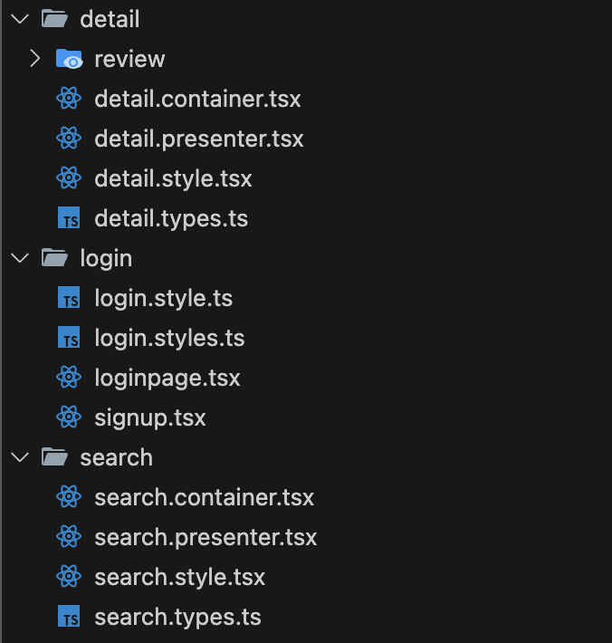

# 3주차 FE 스터디

## 🏅 학습 목표

프로젝트에서 사용된 코드를 리뷰하면서, 리액트 구조에 대한 이해와 서버와의 통신 과정 및 styled-component 사용법에 대하여 학습. (연합 해커톤 대비)

## ✏️ 학습 내용

## **1. Presentational & Container Component Design Pattern**

> **디자인 패턴(Design Pattern)이란?**
디자인 패턴은 **선배들의 경험이 담긴 문제 해결 방법**입니다. 예로부터 건물을 지을 때는 사전 설계가 중요했습니다. 어떤 문제나 수정 사항이 발생했을 때, 하나하나 시행착오를 겪으면서 다시 짓기에는 시간과 비용이 많이 들기 때문입니다. 사람들은 **같은 실수를 반복하지 않기 위해** 자신들의 시행착오를 바탕으로 **특정 상황에서 발생하는 문제 패턴을 발견하고 해결방안을 기록**으로 남겼습니다. 이를 **‘디자인 패턴’** 이라고 부릅니다.

(출처:https://www.hanbit.co.kr/channel/category/category_view.html?cms_code=CMS6705039023)
> 

리액트 디자인 패턴에 관한 글을 여럿 찾아 보면, 조금 더 구조 설계(특히 폴더 구조 관리)와 business logic - view logic의 관리 부분에 초점이 맞춰진 느낌이다.

- **Presentational Component**
    - 화면에 표시하는 것만 담당. props를 통해서 데이터나 콜백을 받아옴
    - UI와 관련된 상태만 가짐

- **Container Component**
    - 동작, data fetch 등의 JavaScript로 이루어진 logic 코드만을 담당
    - Presentational Component에 보여줄 데이터를 가져오거나, 변화시키거나, 행동/동작 등을 정의
    - DOM Markup이나 스타일(css) 없이, 연관이 있는 서브 컴포넌트를 렌더링

### 예제 코드


위와 같이, 하나의 페이지 단위를 container-presenter 단위로 나누는 것이 **Presentational & Container Component Design Pattern 입니다.**

추가로, style.tsx 파일에 CSS 코드를 따로 관리하는 방식은 일반적으로 **Styled Components** 또는 **Emotion** 같은 CSS-in-JS 라이브러리를 사용할 때 자주 쓰이는 패턴입니다. (이런 style.tsx 파일은 엄밀히 말하면 **컴포넌트**라기보다는 **스타일링 모듈**에 가깝습니다)

### detail.container.tsx

```tsx
...생략
import DetailUI from './detail.presenter';
export default function DetailPage(props: DetailUIProps) {
   const [productDetail, setProductDetail] = useState<any | null>(null);
   const [productReview, setProductReview] = useState<any | null>(null);
   const [userReview, setUserReview] = useState<any | null>(null);
   const [sortOption, setSortOption] = useState('rating');
   const [currentPage, setCurrentPage] = useState(1);
   const reviewsPerPage = 2;
   const [reviewModalIsOpen, setReviewModalIsOpen] = useState<boolean>(false);
   const { productId } = useProductStore();
   const getRisk = (status: string) => {
      switch (status) {
         case 'GOOD':
            return 0;
         case 'BAD':
            return 1;
         case 'NEUTRAL':
            return 2;
         default:
            return null;
      }
   };

   const getTopKeywords = (keywordList: KeywordList) => {
      if (!keywordList) return [];
      
      ... 생략
      
   return (
      <PageWrapper>
         <DetailUI
            handleClose={props.handleClose}
            productDetail={productDetail}
            openReviewModal={openReviewModal}
            topKeywords={topKeywords}
            getRisk={getRisk}
            productReview={productReview}
            userReview={userReview}
            getKeywordDisplayText={getKeywordDisplayText}
            handleSortChange={handleSortChange}
            sortOption={sortOption}
            reviewModalIsOpen={reviewModalIsOpen}
            closeReviewModal={closeReviewModal}
            currentPage={currentPage}
            reviewsPerPage={reviewsPerPage}
            sortedReviews={sortedReviews}
            handlePageChange={handlePageChange}
            currentReviews={currentReviews}
            calculateAverageRating={calculateAverageRating}
            fetchProductUserReview={fetchProductUserReview}
            fetchProductReview={fetchProductReview}
         />
      </PageWrapper>
   );
}

```

하나의 페이지에서 로직을 담당하는 코드들은 모두 container 컴포넌트에서 관리하는 것을 확인할 수 있습니다.

또한, UI를 구성하는 presenter 컴포넌트를 Import해서 필요한 props들을 전달해주고 UI를 렌더링합니다. 

### detail.presenter.tsx

```tsx
// import {DetailPageWrapper, Like ...} from './detail.style';
import * as S from './detail.style'; //일일이 import하기 힘드니까 S로 한번에 받아와서 사용하겠다는 것
export default function DetailUI(props: any): JSX.Element {
   return (
      <S.DetailPageWrapper>
         {props.productDetail && props.userReview && (
            <>
               <S.Like style={{ display: 'flex', justifyContent: 'center', alignItems: 'center' }}>
                  <S.HeartIcon />
                  <span
                     style={{
                        fontFamily: 'var(--based-family)',
                        color: 'var(--primary-color)',
                        fontWeight: '900',
                        fontSize: '32px',
                        marginBottom: '5px',
                     }}>
                     {props.productDetail.likes}
                  </span>
               </S.Like>
            <>
               ...
    </S.DetailPageWrapper>
```

UI를 구성하는 코드들(html,css)은 모두 presenter 컴포넌트에서 관리합니다.

위 코드에서는 emotion styled component를 사용했기때문에 css코드는 style.tsx 파일에서 관리했습니다.

---

## **2. Styled-Component (CSS-in-JS)**

```tsx
import styled from '@emotion/styled';
export const DetailPageWrapper = styled.div`
   width: 100%;
   height: auto;
   display: flex;
   flex-direction: column;
   align-items: center;
   justify-content: center;
`;

export const ProductInfoWrapper = styled.div`
   display: flex;
   justify-content: center;
   align-items: center;
   gap: 50px;
   background: white;
   width: 100%;
   height: 50%;
   margin-top: 40px;
`;

export const ProductName = styled.span`
   font-size: 35px;
   font-weight: bold;
`;

export const Rating = styled.div`
   font-size: 18px;
   color: var(--primary-color);
   margin-top: 10px;
`;
```

모듈화해서 UI 구성 담당인 presenter 컴포넌트에서 사용할 것이기 때문에 **export** 키워드를 붙여줘야 합니다.

styled-component를 작성하고 사용하는 방법은 매우 단순합니다.

**export const 사용할태그명 = styled.사용할css태그 `**

              태그에 적용시킬 css 코드

`

---

## **3. 서버와의 API 통신(feat. axios)**

```tsx
import axios from 'axios';
//get 요청
const fetchProductDetail = async () => {
      try {
         const response = await axios.get<any>(`엔드포인트URL/api/v1/member/product/findDetail/${productId}`);
         setProductDetail(response.data.data);
         console.log('Fetched product detail:', response.data.data); // Fetch 후 즉시 로그 출력
      } catch (error) {
         console.error('호출 실패', error);
      }
   };
//post 요청
const postProduct = async (productData: any) => {
  try {
    const response = await axios.post('엔드포인트URL/api/v1/member/product/register', productData);
    console.log('Product successfully registered:', response.data);
  } catch (error) {
    console.error('상품 등록 실패', error);
  }
};
const newProduct = {
  name: "새로운 상품",
  description: "이 상품은 매우 훌륭합니다.",
  price: 10000,
  category: "전자제품",
  // 기타 필요한 필드들
};
postProduct(newProduct);
```

try-catch 문을 사용하는 이유는 **비동기 코드**에서 발생할 수 있는 **에러를 안전하게 처리**하기 위함입니다. 

특히, 위와 같이 api통신 과정에서 **HTTP 요청**을 사용하는 경우, 네트워크 문제, 서버 에러, 잘못된 요청 등 다양한 이유로 오류가 발생할 수 있기 때문에 이를 처리하는 것이 중요합니다.

### Axios가 Fetch보다 나은 점

- 웹 브라우저 호환성과 보완성이 우수
- JSON변환, 문자열 변환을 자동으로 해줌.(JSON.stringify 사용안해도 됨)
- Request TimeOut 설정 등 많은 기능을 사용할 수 있음.