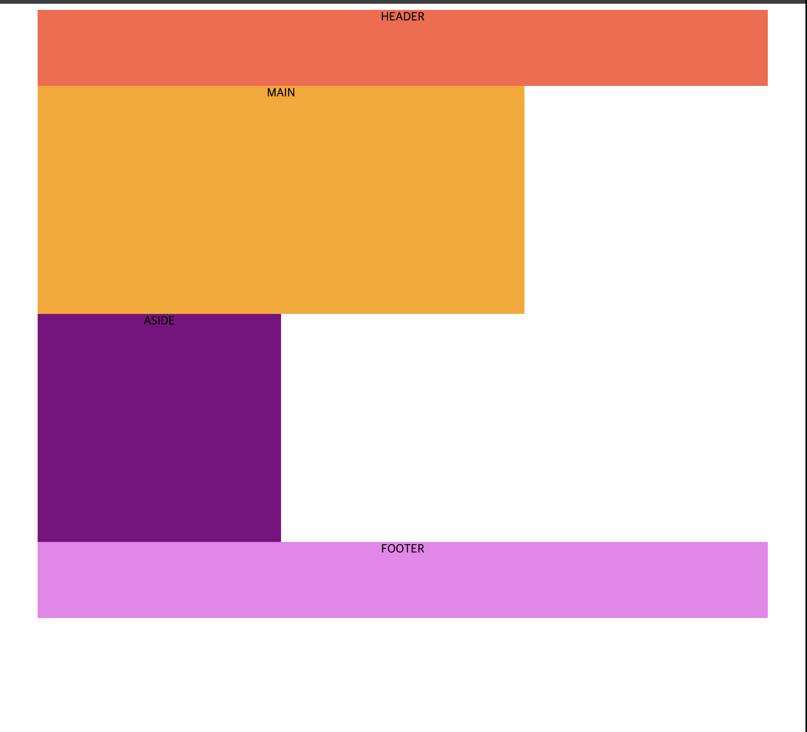
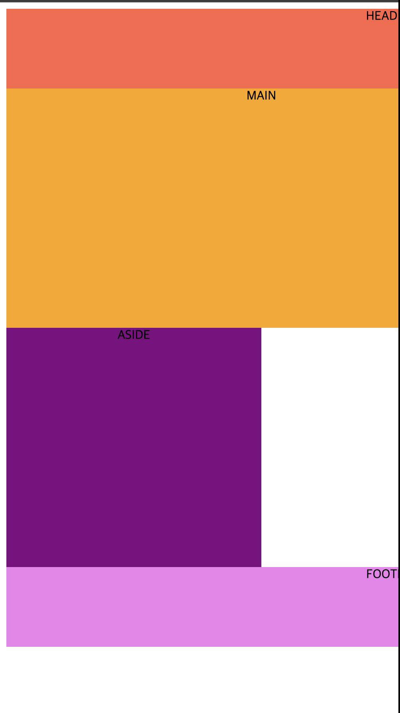
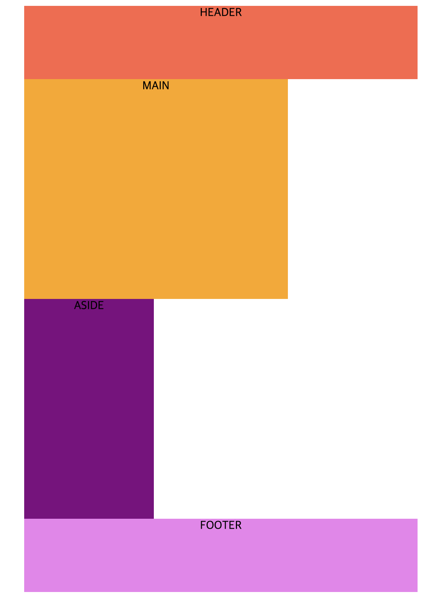
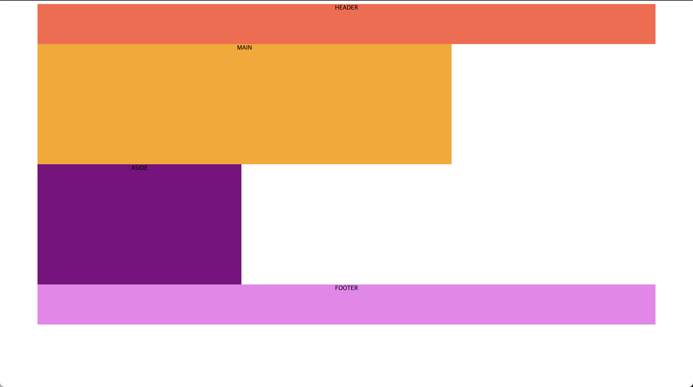

# 반응형 웹 학습
## 단위
* **`px`** : 절대길이단위이며, 어떤 상황에서도 동일한 값을 유지하므로 가변성이 없음.
* **`em, rem`** : 박스에서 텍스트 크기를 조정할 때 사용하는 상대 단위임. em은 부모요소의 글꼴 크기, rem은 루트 요소(html태그: 기본 16px)의 글꼴 크기를 의미함.

> em으로 내,외부 여백 크기를 지정할 때는 부모 요소 기준이 아니라 **자기 자신의 글자 크기를 기준**으로 한다.

em과 rem은 주변 상황에 따라 그 크기를 달리할 수 있는 가변성을 지니고 있지만, <strong>브라우저나 기기 화면의 크기에 따라 크기가 달라지는 단위는 아니다.</strong>
따라서, 진정한 반응형 단위라고 할 수는 없다!

---

## 반응하는 단위들(viewport+ w,h,min,max)
* **`vw`**  
: 실제 기기 화면 너비 기준이고, 단위 앞 숫자는 백분율을 나타냄 (ex: 1vw => 화면 너비 1/100 크기)
* **`vh`**  
: 실제 기기 화면 높이 기준이고, 단위 앞 숫자는 백분율을 나타냄 (ex: 50vh => 화면 높이의 1/2 크기)
* **`vmin`** 
: 뷰 포트의 너비와 높이 중 작은 거에 기준을 맞추겠다.
* **`vmax`** 
: 뷰 포트의 너비와 높이 중 큰 거에 기준을 맞추겠다.

## 가변 그리드
* **부모 요소의 크기에 비례해 자식 요소의 크기가 변하는 방식**은 **가변 레이아웃**을 만들 때 흔히 사용되는 방식이다.

> `%` 단위는 백분율 값을 나타낸다. 부모 요소와의 상대적 크기를 지정할 때 사용하고, 너비와 높이, 여백, 글자크기 모두 사용 가능하다

### px단위 사용

px단위만 사용해서 레이아웃을 구성했을 때는 위와 같은 구조에서 만약 브라우저 화면 크기가 더 작아진다면, 아래 그림처럼 블록들이 깨지게 된다.

### %단위 사용
예제2 코드에서는 % 단위를 사용해서 뷰포트 크기에 따라 가변 레이아웃을 구성한 결과 다양한 화면 크기에서도 깨지지않고, 비율을 유지한  채 변화하는 모습을 확인할 수 있었습니다.

> padding을 %단위를 사용해서 지정할 경우에는  자기 자신의 크기를 기준으로 하는 것이 아니라, **부모 요소의 크기를 기준으로 계산**한다! (더욱 더 레이아웃 균형을 유지하는 데에 용이함)

## 함수 개념과 calc()

css의 함수는 괄호 안에 인수를 전달하면, 인수에 따른 결과값을 속성에 적용하는 방식으로 동작합니다.

## 미디어 쿼리
미디 쿼리는(media query)는 미디어 타입을 인식하고, 콘텐츠를 읽어들이는 기기나 브라우저의 물리적 속석을 감지할 수 있는 유용한 장치(기능)입니다.

~~~css
@meadia 미디어_타입 and (조건에_대한_물음(쿼리문)) {
    /*
    미디어 타입과 조건을
    모두 만족할 때 덮어씌울 스타일 선언문
    */
}
~~~

미디어 타입은 여러 가지가 있는데, 그 중에서 브라우저 화면을 나타내는 'screen'이 보편적으로 사용된다.

### 미디어 쿼리 예제
~~~css
/*최대 너비가 800px => 800px보다 작은 기기를 말함*/
/*최소 너비가 800px => 800px보다 큰 기기를 말함*/
/*그냥 width로 설정해도 되는데, 해당 값일때만 적용됨*/
@media screen and (min-width: 800px){
    img{
        width: 400px;
        height: 400px;
    }
}
~~~
위와 같은 코드의 동작을 살펴보면, 최소 너비가 800px 즉, 너비가 800px보다 커지면 img의 크기를 w-400px, h-400px로 지정한다.

> 미디어 쿼리는 하나만 가능한 것이 아니라 여러 개를 지정해줄 수 있다! (800이상일 때, 1200이상일 때 등등)

## 가변 이미지

* **`max-width vs width`** 
**max-width**속성은 이보다 너비가 커질 수 없음 즉, 제한길이를 지정하는 것이고,
**width** 속성은 너비를 지정하는 것
~~~css
img{
    /*이미지가 부모요소보다 커질 수 없음!*/
    max-width: 100%;
}
~~~

* **`picture`**
picture 태그는 뷰포트의 너비 등 브라우저의 특정 조건에 따라 **이미지를 반응형으로 불러 올 수 있다**!
~~~html
<picture>
    
    <source srcset="/conditionImg.jpeg" media="(min-width: 1200px)">
</picture>
~~~

picture 요소 안에 img는 초기에 보여지는 이미지, source는 상황에 맞춰서 변경될 이미지 태그로 사용할 수 있다.

## 가변 동영상

내가 가지고 있는 동영상 너비를 지정하고 그런 것은 문제가 안되는데, 유튜브 같은 곳에서 영상을 임베드할 때 문제가 생긴다.  
이런 경우 width, height 속성 지정으로만으로는 해결할 수 없다.

~~~css
.player{
    /*종횡비 입력*/
    padding-top: 56.25%;
    position: relative;
}
iframe{
    position: absolute;
    top: 0; left: 0;
    width: 100%;
    height: 100%;
}
~~~
~~~html

    <iframe width="560" height="315" src="https://www.youtube.com/~">
    </iframe>

~~~

